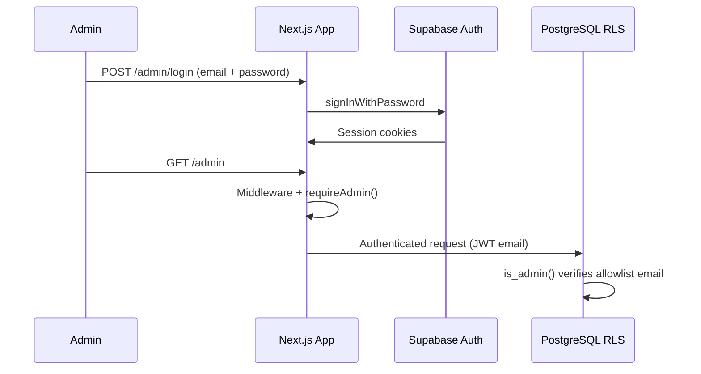

# Admin Authorization

How admin access is enforced for the single-admin portfolio CMS.

---

## Current State (Phase 4)

Admin authentication uses **Supabase Email/Password** with a single administrator.

| Layer | Mechanism |
|-------|-----------|
| Authentication | Supabase Auth session (email + password) |
| App authorization | `ADMIN_EMAIL` environment variable |
| Route protection | Next.js middleware on `/admin/*` |
| Server helpers | `requireAdmin()`, `isAdmin()`, etc. in `src/lib/auth/` |
| Database RLS | `is_admin()` checks JWT email against `settings.admin_allowlist` |

### Flow



---

## Admin identity

One admin user, created manually in Supabase Dashboard → Authentication → Users.

The application recognizes only the email configured in:

```env
ADMIN_EMAIL=admin@example.com
```

All other authenticated users receive **403 Unauthorized** at `/admin/unauthorized`.

---

## Bootstrap allowlist (database)

Phase 3 RLS uses a temporary JSON allowlist in `settings`:

```json
{
  "emails": ["admin@example.com"],
  "github_ids": []
}
```

`is_admin()` compares JWT `email` and `sub` against this row. Keep `ADMIN_EMAIL` and `admin_allowlist.emails` aligned.

> **Note:** `settings.admin_allowlist` remains a bootstrap mechanism until a dedicated `admin_users` table is introduced in Phase 5+.

---

## Security invariants

1. **`SUPABASE_SECRET_KEY` never exposed to the browser**
2. **Admin routes protected in middleware** — not client-side only
3. **Server Components use `requireAdmin()`** for privileged pages
4. **Public users cannot write CMS data** — RLS blocks non-admin mutations
5. **Contact form is the only public write** — `contact_submissions` INSERT policy
6. **Published content only** — public SELECT where `status = 'published'`

---

## Phase 5+ enhancements

| Enhancement | Description |
|-------------|-------------|
| `admin_users` table | Dedicated roles instead of env + JSON allowlist |
| Audit log | Track admin content changes |
| Session hardening | Optional MFA via Supabase |

---

## Related documents

- [Authentication](./authentication.md) — login flow, routes, helpers
- [Database Design](./database-design.md) — RLS policy summary
- [Roadmap](./roadmap.md) — Phase 5 admin dashboard scope
