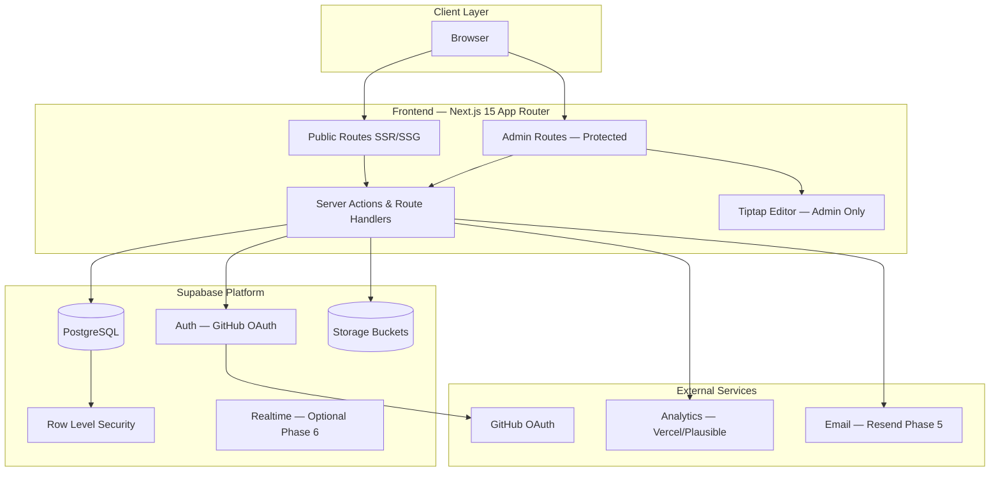
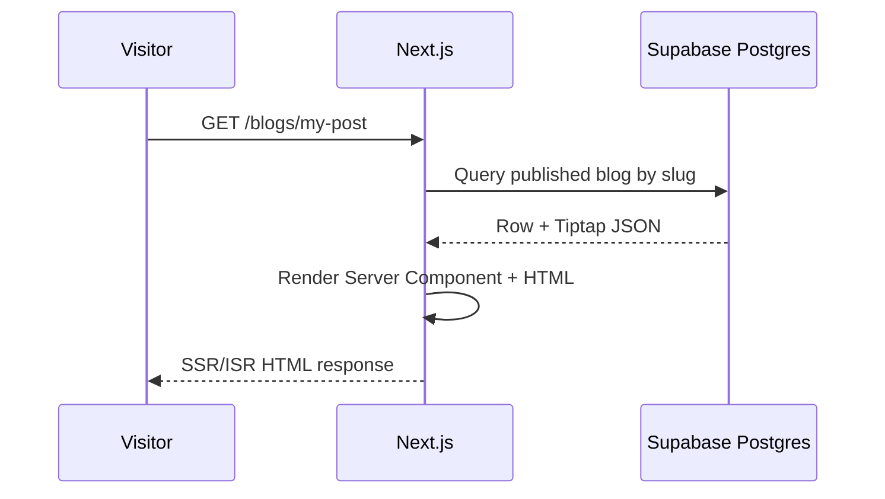
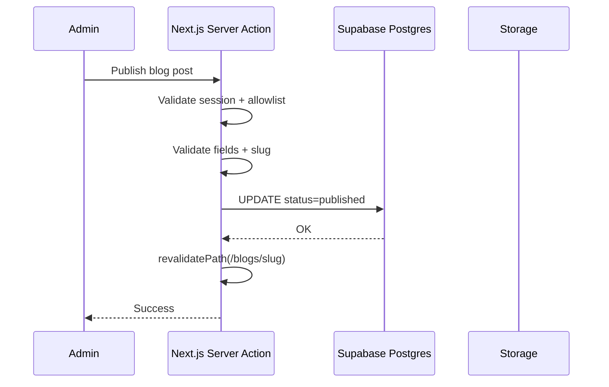
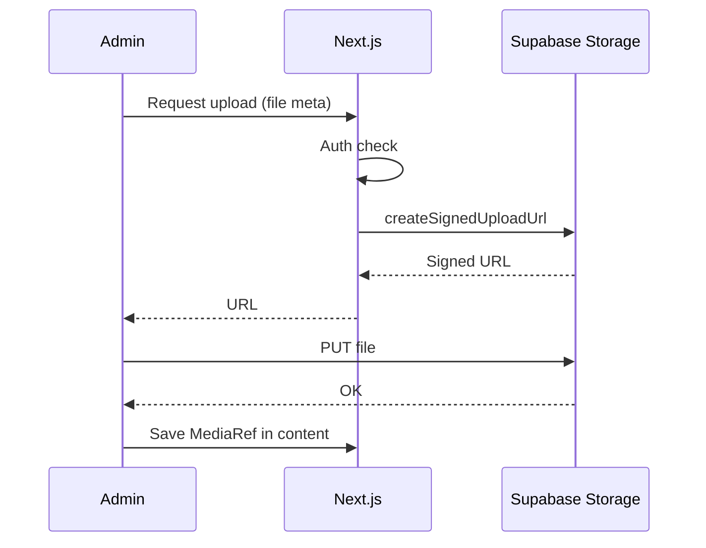
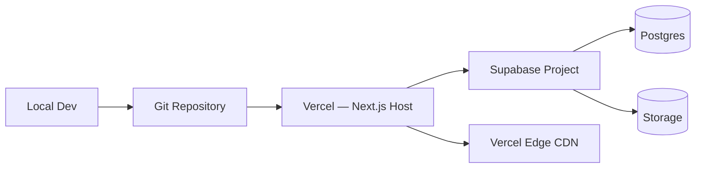

# Technical Architecture

This document describes the system architecture, component boundaries, data flow, and future expansion strategy for the AI Engineer Portfolio.

---

## High-Level Architecture



---

## Layer Responsibilities

### Frontend (Next.js 15)

**Owns:**
- All UI rendering (public site + admin CMS)
- Route definitions and layouts
- Client-side interactivity (filters, editor, form UX)
- Server Components for data fetching on public pages
- Server Actions for mutations (admin CRUD, contact form)
- ISR/revalidation strategy for published content
- SEO: metadata, sitemap.xml, robots.txt, JSON-LD
- Tiptap editor integration and preview rendering

**Does not own:**
- Persistent data storage logic (delegated to Supabase client/server)
- Long-running background jobs (future: Supabase Edge Functions or cron)
- Raw file storage (upload orchestration only)

### Backend (Supabase + Next.js Server Layer)

**Owns:**
- Business rules enforced in Server Actions and RLS policies
- Authentication session validation
- Signed upload URL generation
- PDF resume generation (server-side, Phase 4)
- Contact form ingestion and validation
- Webhook handlers (future: newsletter, GitHub sync)

**Pattern:** Prefer **Backend-for-Frontend (BFF)** via Next.js Route Handlers and Server Actions rather than a separate API server. Supabase exposes Postgres and Storage; Next.js is the orchestration layer.

### Database (Supabase PostgreSQL)

**Owns:**
- All structured content (see `content-model.md`)
- User sessions reference (via Supabase Auth `auth.users`)
- Junction tables for many-to-many relations
- Full-text search vectors (Phase 6)
- Contact submissions, audit logs

**Access:** Service role key server-only; anon key with strict RLS for any client-side reads if needed.

### Storage (Supabase Storage)

**Owns:**
- Resume PDFs
- Blog/project cover images
- Inline editor media
- OG default images

**Buckets (planned):**
| Bucket | Access | Contents |
|--------|--------|----------|
| `public-assets` | Public read | Covers, avatars, published media |
| `resume` | Public read | Generated PDFs |
| `uploads` | Authenticated write | Editor uploads; public read via CDN URL |

### CMS (Admin Module within Next.js)

**Owns:**
- Content CRUD UI for all types
- Draft/autosave/publish workflow
- Preview mode
- Media library browser
- Settings management

**Not a third-party CMS** (no Sanity, Contentful). The admin app *is* the CMS, backed by Supabase.

### Authentication

**Owns:**
- GitHub OAuth via Supabase Auth
- Session cookies (HTTP-only, secure)
- Admin route middleware protection
- Allowlist check against `Settings.allowlist_github_ids`

**Public site:** No auth required.

### Search

**Phase 1–5:** Postgres queries with `ILIKE`, tag filters, and indexed slug lookups.

**Phase 6+:** Postgres `tsvector` generated columns + GIN indexes; optional Meilisearch if >10k documents or sub-100ms requirement.

**Frontend:** Search UI and debouncing; no search engine in browser beyond client filter for small lists.

### Analytics

**Owns:**
- Page view events (privacy-conscious provider)
- Custom events: resume_download, contact_submit, project_view

**Does not own:** PII storage in analytics; anonymized metrics only.

---

## Data Flow Diagrams

### Public Page Read Path



### Admin Publish Path



### Media Upload Path



---

## Deployment Architecture



- **Hosting:** Vercel (aligned with Next.js 15)
- **Environments:** `development`, `preview`, `production`
- **Secrets:** Vercel env vars; never expose service role to client
- **Preview deploys:** Supabase preview branch or separate project (Phase 2 decision)

---

## Security Architecture

| Concern | Approach |
|---------|----------|
| Admin access | GitHub OAuth + allowlist |
| Data access | RLS: public read published only; admin write via authenticated role |
| CSRF | Server Actions built-in protection |
| XSS | Sanitize Tiptap output on render; strict schema |
| Upload abuse | MIME allowlist, size limits, auth required |
| Rate limiting | Contact form + auth endpoints via middleware or Vercel firewall |
| Secrets | Service role server-only; Vault for sensitive Settings (Phase 5) |

---

## Rendering Strategy

| Route type | Strategy | Revalidation |
|------------|----------|--------------|
| `/`, index pages | ISR or SSG with on-demand revalidate | On publish |
| `/[slug]` detail | ISR per slug | On publish/update |
| `/admin/*` | Dynamic (no cache) | N/A |
| `/contact` | Static shell + dynamic action | N/A |

---

## Future Expansion Strategy

Each future feature maps to existing boundaries without architectural rewrites.

### Open Source Showcase (Phase 7)

- **Fit:** Extend `Projects.metadata.open_source` + optional GitHub API sync job
- **Routes:** Filter on `/projects` or optional `/open-source`
- **Storage:** Repo stats cached in Postgres, not live GitHub calls on every request

### Newsletter (Phase 8)

- **Fit:** New `NewsletterIssue` content type OR `Blogs` with `series=newsletter`
- **Routes:** `/newsletter` archive; subscribe form on `/`
- **Backend:** Edge Function + Resend/Brevo; subscriber table in Postgres
- **Boundary:** Email sending external; subscription state in Database

### AI Demos (Phase 8)

- **Fit:** `Projects.metadata.demo_config` + optional `/demos/[id]` route
- **Frontend:** iframe or isolated React widget; API keys server-side only
- **Backend:** Route Handler proxies LLM calls; rate limited
- **Storage:** Demo assets in Storage bucket

### Public Notes (Phase 7)

- **Fit:** `Research` with `research_type=note` OR dedicated `Notes` table same shape
- **Routes:** `/notes` or `/research?type=note`
- **Search:** Same FTS pipeline as Research

### Research Publications (Phase 9)

- **Fit:** Extend `Research` with publication metadata (DOI, arXiv, citation)
- **Routes:** Existing `/research`; optional BibTeX export endpoint
- **Storage:** PDF reprints in Storage if permitted

### Speaking Engagements (Phase 9)

- **Fit:** New `SpeakingEngagement` table OR `Experience`-like timeline events
- **Routes:** `/talks` or section on `/experience`
- **Relationships:** Link to slides in Storage, related blog posts

### Expansion Principle

> New features add **content types**, **optional routes**, and **Route Handlers** — not new deployment units or databases.

---

## Scalability Considerations

| Dimension | Initial | Scale Path |
|-----------|---------|------------|
| Traffic | Vercel serverless | Edge caching, ISR |
| Content volume | Hundreds of docs | FTS, pagination, archive pages |
| Media | Supabase Storage | CDN via Supabase public URLs; image optimization via Next.js Image |
| Admin users | Single admin | Role column + RLS policies |
| Multi-region | Single Supabase region | Read replicas if needed (Supabase Pro) |

---

## Monorepo Structure (Planned)

```
/
├── app/                    # Next.js App Router
│   ├── (public)/           # Public layout group
│   ├── admin/              # Admin layout group
│   └── api/                # Route handlers (webhooks, OG, resume PDF)
├── components/             # Shared UI (Phase 2+)
├── lib/
│   ├── supabase/           # Client, server, middleware helpers
│   ├── content/            # Validators, serializers, Tiptap schema
│   └── pdf/                # Resume generator
├── docs/                   # This planning documentation
└── supabase/               # Migrations, seed (Phase 2)
```

---

## Related Documents

- [Sitemap](./sitemap.md)
- [Content Model](./content-model.md)
- [User Flows](./user-flows.md)
- [Technical Decisions](./technical-decisions.md)
- [Roadmap](./roadmap.md)
