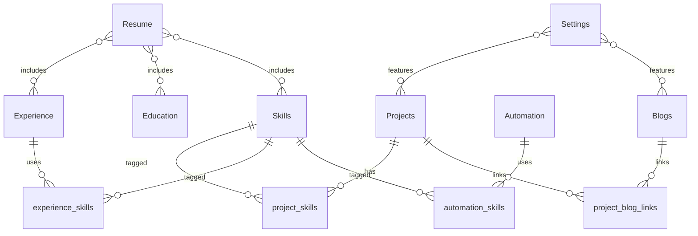

# Content Model

This document defines all content types, their fields, validation, relationships, and search requirements. **Planning only — no database implementation.**

---

## Design Principles

1. **Single source of truth** — Structured data in Postgres; rich text stored as Tiptap JSON (JSONB).
2. **Slug uniqueness per type** — `projects/my-app` and `blogs/my-app` may coexist; slugs unique within table.
3. **Publish workflow** — All public content supports `draft | published | archived`.
4. **Extensibility** — JSON `metadata` column on each type for forward-compatible fields.
5. **Search-ready** — Denormalized `search_vector` or generated tsvector columns planned for Phase 6.

---

## Shared Enums & Types

```
ContentStatus: draft | published | archived
MediaRef: { url, alt, width?, height?, mime_type? }
TiptapDocument: JSON (ProseMirror-compatible schema)
```

### Shared Base Fields (all primary content types)

| Field | Type | Required | Notes |
|-------|------|----------|-------|
| `id` | UUID | Yes | Primary key |
| `slug` | string | Yes | URL-safe, unique per table |
| `title` | string | Yes | Max 200 chars |
| `status` | ContentStatus | Yes | Default `draft` |
| `published_at` | timestamptz | Conditional | Required when `status = published` |
| `created_at` | timestamptz | Yes | Auto |
| `updated_at` | timestamptz | Yes | Auto |
| `metadata` | JSONB | No | Extension point |

---

## Projects

### Purpose

Portfolio case studies showcasing engineering work, AI systems, and outcomes.

### Fields

| Field | Type | Required | Validation |
|-------|------|----------|------------|
| `slug` | string | Yes | `^[a-z0-9]+(?:-[a-z0-9]+)*$`, unique |
| `title` | string | Yes | 1–200 chars |
| `excerpt` | string | Yes | 1–500 chars |
| `body` | TiptapDocument | Yes | Non-empty when publishing |
| `cover_image` | MediaRef | No | Valid URL in Storage |
| `featured` | boolean | Yes | Default false |
| `tech_stack` | string[] | No | Each tag 1–50 chars |
| `project_url` | string | No | Valid HTTPS URL |
| `repo_url` | string | No | Valid HTTPS URL |
| `started_at` | date | No | |
| `completed_at` | date | No | >= started_at if both set |
| `role` | string | No | Max 100 chars |
| `sort_order` | integer | No | For manual ordering on index |
| `status` | ContentStatus | Yes | |
| `published_at` | timestamptz | Conditional | |
| `metadata` | JSONB | No | e.g. `demo_embed_url`, `open_source: true` |

### Relationships

- **Many-to-many** with `Skills` via `project_skills`
- **Many-to-many** with `Blogs` via `project_blog_links` (related articles)
- **Optional self-ref** `related_project_ids` for "See also"

### Searchability

- Index: title, excerpt, body plain text, tech_stack
- Filters: featured, tags, date range, status (admin)
- Future: `type` in metadata for open-source filter

---

## Experience

### Purpose

Structured employment history for timeline and resume generation.

### Fields

| Field | Type | Required | Validation |
|-------|------|----------|------------|
| `id` | UUID | Yes | |
| `company` | string | Yes | 1–200 chars |
| `title` | string | Yes | 1–200 chars |
| `location` | string | No | Max 200 chars |
| `employment_type` | enum | No | `full_time`, `contract`, `freelance`, `internship` |
| `description` | TiptapDocument | No | |
| `started_at` | date | Yes | |
| `ended_at` | date | No | Null = present; >= started_at |
| `company_url` | string | No | Valid URL |
| `logo` | MediaRef | No | |
| `sort_order` | integer | Yes | Display order (desc by date default) |
| `is_current` | boolean | Yes | Default false; only one current recommended |
| `status` | ContentStatus | Yes | Usually published |
| `metadata` | JSONB | No | |

### Relationships

- **Many-to-many** with `Skills` via `experience_skills`
- **One-to-many** from `Resume` (resume pulls experience rows by sync rules)

### Searchability

- Index: company, title, description plain text
- Public timeline: only `published` entries

---

## Research

### Purpose

Research notes, experiments, reading summaries, and future publications.

### Fields

| Field | Type | Required | Validation |
|-------|------|----------|------------|
| `slug` | string | Yes | Unique |
| `title` | string | Yes | 1–200 chars |
| `abstract` | string | No | Max 1000 chars |
| `body` | TiptapDocument | Yes | When publishing |
| `research_type` | enum | Yes | `note`, `experiment`, `publication`, `reading` |
| `status_label` | enum | No | `idea`, `in_progress`, `completed` |
| `topics` | string[] | No | Tag-like |
| `external_url` | string | No | Paper/link URL |
| `published_at` | timestamptz | Conditional | |
| `status` | ContentStatus | Yes | |
| `metadata` | JSONB | No | DOI, arXiv ID, coauthors (Phase 9) |

### Relationships

- **Many-to-many** with `Projects` (research enabled project)
- **Many-to-many** with `Blogs` (write-ups)

### Searchability

- Index: title, abstract, body, topics
- Filter: research_type, status_label

---

## Automation

### Purpose

Catalog of automation systems, workflows, and integrations.

### Fields

| Field | Type | Required | Validation |
|-------|------|----------|------------|
| `slug` | string | Yes | Unique |
| `title` | string | Yes | 1–200 chars |
| `summary` | string | Yes | 1–500 chars |
| `body` | TiptapDocument | No | |
| `category` | enum | Yes | `ci_cd`, `data`, `ai_agent`, `integration`, `other` |
| `stack` | string[] | No | |
| `outcome` | string | No | Metrics or results, max 500 chars |
| `demo_url` | string | No | Valid URL |
| `status` | ContentStatus | Yes | |
| `published_at` | timestamptz | Conditional | |
| `metadata` | JSONB | No | `health_check_url` for Phase 10 |

### Relationships

- **Optional FK** to `Projects` (if automation is part of a project)
- **Many-to-many** with `Skills`

### Searchability

- Index: title, summary, body, stack, category

---

## Blogs

### Purpose

Long-form articles, tutorials, and technical posts.

### Fields

| Field | Type | Required | Validation |
|-------|------|----------|------------|
| `slug` | string | Yes | Unique |
| `title` | string | Yes | 1–200 chars |
| `excerpt` | string | Yes | 1–500 chars |
| `body` | TiptapDocument | Yes | When publishing |
| `cover_image` | MediaRef | No | |
| `tags` | string[] | No | Normalized lowercase |
| `reading_time_minutes` | integer | No | Auto-calculated from word count |
| `series` | string | No | Group name for future newsletter |
| `canonical_url` | string | No | If syndicated |
| `seo_title` | string | No | Max 70 chars |
| `seo_description` | string | No | Max 160 chars |
| `status` | ContentStatus | Yes | |
| `published_at` | timestamptz | Conditional | |
| `metadata` | JSONB | No | |

### Relationships

- **Many-to-many** with `Projects`
- **Many-to-many** with `Research`

### Searchability

- High priority: title, excerpt, body, tags
- Public RSS feed from published posts

---

## Skills

### Purpose

Canonical taxonomy for technologies and competencies referenced across content.

### Fields

| Field | Type | Required | Validation |
|-------|------|----------|------------|
| `id` | UUID | Yes | |
| `name` | string | Yes | Unique, 1–80 chars |
| `slug` | string | Yes | Unique |
| `category` | enum | Yes | `language`, `framework`, `tool`, `cloud`, `ai_ml`, `soft`, `other` |
| `proficiency` | enum | No | `learning`, `proficient`, `expert` |
| `icon` | string | No | Icon key or URL |
| `description` | string | No | Max 300 chars |
| `sort_order` | integer | No | |
| `show_on_landing` | boolean | Yes | Default false |

### Relationships

- **Many-to-many** with Projects, Experience, Automation

### Searchability

- Admin filter by category and name
- Public: aggregated on landing when `show_on_landing = true`

---

## Education

### Purpose

Degrees, certifications, and formal training.

### Fields

| Field | Type | Required | Validation |
|-------|------|----------|------------|
| `id` | UUID | Yes | |
| `institution` | string | Yes | 1–200 chars |
| `degree` | string | Yes | 1–200 chars |
| `field_of_study` | string | No | Max 200 chars |
| `started_at` | date | No | |
| `ended_at` | date | No | |
| `description` | string | No | Max 1000 chars |
| `credential_url` | string | No | Valid URL |
| `sort_order` | integer | Yes | |
| `status` | ContentStatus | Yes | |

### Relationships

- Pulled into `Resume` document generation
- Displayed on `/experience` as subsection

### Searchability

- Admin list filter by institution

---

## Resume

### Purpose

Authoritative resume configuration and generated PDF artifact(s).

### Fields

| Field | Type | Required | Validation |
|-------|------|----------|------------|
| `id` | UUID | Yes | Singleton row or `variant` key |
| `variant` | string | Yes | Default `default`; unique per variant |
| `headline` | string | Yes | Max 200 chars |
| `summary` | string | No | Max 2000 chars |
| `contact_email` | string | No | Valid email |
| `contact_phone` | string | No | |
| `location` | string | No | |
| `sections_config` | JSONB | Yes | Order and visibility of sections |
| `include_experience_ids` | UUID[] | No | Empty = all published |
| `include_education_ids` | UUID[] | No | Empty = all published |
| `include_skill_ids` | UUID[] | No | Empty = curated or all |
| `custom_sections` | JSONB | No | Freeform Tiptap blocks |
| `pdf_url` | string | No | Storage URL after generation |
| `pdf_generated_at` | timestamptz | No | |
| `version` | integer | Yes | Increment on each publish |
| `status` | ContentStatus | Yes | |

### Relationships

- **References** Experience, Education, Skills (by ID arrays or sync job)
- **Not slug-routed** — consumed via download API and `/experience`

### Searchability

- N/A for public search; admin only

---

## Settings

### Purpose

Global site configuration (singleton document).

### Fields

| Field | Type | Required | Validation |
|-------|------|----------|------------|
| `id` | UUID | Yes | Single row |
| `site_name` | string | Yes | Max 100 chars |
| `site_description` | string | Yes | Max 300 chars |
| `site_url` | string | Yes | Valid URL |
| `owner_name` | string | Yes | |
| `owner_title` | string | Yes | |
| `owner_avatar` | MediaRef | No | |
| `social_links` | JSONB | No | `{ github, linkedin, twitter, ... }` |
| `contact_email` | string | Yes | Valid email |
| `featured_project_ids` | UUID[] | No | Max 4 for homepage |
| `featured_blog_ids` | UUID[] | No | Max 5 |
| `section_visibility` | JSONB | Yes | Toggle homepage sections |
| `feature_flags` | JSONB | No | Module toggles |
| `analytics_id` | string | No | |
| `allowlist_github_ids` | string[] | Yes | Admin OAuth allowlist |
| `seo_defaults` | JSONB | No | OG image, robots |
| `updated_at` | timestamptz | Yes | |

### Relationships

- References featured content by ID
- No foreign keys enforced on featured IDs (graceful fallback if deleted)

### Searchability

- N/A

---

## Supporting Entities (Phase 2+)

### ContactSubmission

| Field | Type | Notes |
|-------|------|-------|
| `id` | UUID | |
| `name` | string | |
| `email` | string | |
| `subject` | string | Optional |
| `message` | text | |
| `created_at` | timestamptz | |
| `read` | boolean | Admin inbox Phase 5 |

### MediaAsset

| Field | Type | Notes |
|-------|------|-------|
| `id` | UUID | |
| `storage_path` | string | Supabase Storage path |
| `filename` | string | |
| `mime_type` | string | |
| `size_bytes` | integer | |
| `uploaded_by` | UUID | Auth user |
| `created_at` | timestamptz | |

### ContentRevision (Phase 6)

Snapshot of content JSON before publish for audit and rollback.

---

## Entity Relationship Diagram



---

## Validation Summary Matrix

| Content Type | Slug | Rich Body | Publish Date | Unique Constraints |
|--------------|------|-----------|--------------|-------------------|
| Projects | Yes | Required on publish | Required on publish | slug |
| Experience | No | Optional | N/A | — |
| Research | Yes | Required on publish | Required on publish | slug |
| Automation | Yes | Optional | Required on publish | slug |
| Blogs | Yes | Required on publish | Required on publish | slug |
| Skills | Yes | N/A | N/A | name, slug |
| Education | No | N/A | N/A | — |
| Resume | No | N/A | N/A | variant |
| Settings | No | N/A | N/A | singleton |

---

## Search Index Strategy (Phase 6)

| Content Type | Indexed Fields | Facets |
|--------------|----------------|--------|
| Projects | title, excerpt, body, tech_stack | tags, featured, year |
| Blogs | title, excerpt, body, tags | tags, series |
| Research | title, abstract, body, topics | type, status |
| Automation | title, summary, body, stack | category |
| Experience | company, title, description | current, date |
| Skills | name, category | category, landing |

Implementation options documented in `technical-decisions.md`: Postgres full-text search first; optional Meilisearch if scale demands.
