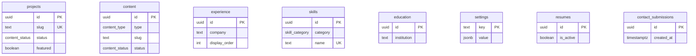

# Database Design

This document describes the Phase 3 Supabase PostgreSQL schema for the AI Engineer Portfolio CMS. It is the authoritative reference for tables, relationships, constraints, indexes, and security before and after migration.

---

## Design Principles

1. **Stable core, flexible extensions** — Required columns are typed and constrained; open-ended data uses JSONB (`content`, `settings.value`).
2. **Unified content model** — Blogs, research, automation, publications, and notes share one `content` table discriminated by `type`.
3. **Publish workflow** — `content_status` enum gates public visibility; `published_at` is enforced when published.
4. **Defense in depth** — Row Level Security on every table; admin access via `is_admin()` helper.
5. **Search-ready** — Generated `tsvector` columns and GIN indexes on searchable tables (Phase 6 UI consumes these).

---

## Entity Relationship Overview

There are **no foreign keys between content domains** in Phase 3. Cross-linking (project ↔ blog) is deferred to Phase 4+ via junction tables or JSONB metadata to avoid premature coupling.

---

## Enums

| Enum | Values | Used By |
|------|--------|---------|
| `content_status` | `draft`, `published`, `archived` | `projects`, `content` |
| `content_type` | `blog`, `research`, `automation`, `publication`, `note` | `content` |
| `skill_category` | `language`, `framework`, `tool`, `cloud`, `ai_ml`, `soft`, `other` | `skills` |
| `skill_proficiency` | `learning`, `proficient`, `expert` | `skills` |

---

## Tables

### `projects`

Portfolio case studies and engineering work.

| Column | Type | Constraints | Rationale |
|--------|------|-------------|-----------|
| `id` | `uuid` | PK, default `gen_random_uuid()` | Stable identifier |
| `slug` | `text` | NOT NULL, UNIQUE, slug format CHECK | SEO-friendly URLs |
| `title` | `text` | NOT NULL, length ≤ 200 | Display title |
| `summary` | `text` | NOT NULL, length ≤ 500 | Card excerpt |
| `content` | `jsonb` | NOT NULL, default `'{}'` | Tiptap document JSON |
| `tech_stack` | `text[]` | NOT NULL, default `'{}'` | Filterable tags |
| `github_url` | `text` | nullable | Repository link |
| `live_url` | `text` | nullable | Demo/production link |
| `featured` | `boolean` | NOT NULL, default `false` | Homepage curation |
| `status` | `content_status` | NOT NULL, default `draft` | Publish workflow |
| `seo_title` | `text` | nullable, length ≤ 70 | Override meta title |
| `seo_description` | `text` | nullable, length ≤ 160 | Override meta description |
| `search_vector` | `tsvector` | generated, stored | Full-text search |
| `created_at` | `timestamptz` | NOT NULL, default `now()` | Audit |
| `updated_at` | `timestamptz` | NOT NULL, default `now()` | Auto-updated via trigger |
| `published_at` | `timestamptz` | nullable | Required when published |

**Public access:** rows where `status = 'published'`.

---

### `experience`

Employment timeline entries.

| Column | Type | Constraints | Rationale |
|--------|------|-------------|-----------|
| `id` | `uuid` | PK | |
| `company` | `text` | NOT NULL | Employer name |
| `role` | `text` | NOT NULL | Job title |
| `start_date` | `date` | NOT NULL | Tenure start |
| `end_date` | `date` | nullable, ≥ start_date | Null = present |
| `location` | `text` | nullable | City/remote |
| `description` | `text` | nullable | Role summary |
| `achievements` | `text[]` | NOT NULL, default `'{}'` | Bullet highlights |
| `tech_stack` | `text[]` | NOT NULL, default `'{}'` | Skills used |
| `display_order` | `integer` | NOT NULL, default `0` | Manual sort (lower = higher) |
| `created_at` | `timestamptz` | NOT NULL, default `now()` | Audit |
| `updated_at` | `timestamptz` | NOT NULL, default `now()` | Auto-updated |

**Public access:** all rows (experience is always visible on `/experience`).

---

### `content`

Unified table for blog posts, research, automation write-ups, publications, and notes.

| Column | Type | Constraints | Rationale |
|--------|------|-------------|-----------|
| `id` | `uuid` | PK | |
| `type` | `content_type` | NOT NULL | Discriminator |
| `slug` | `text` | NOT NULL | Unique per type |
| `title` | `text` | NOT NULL, length ≤ 200 | |
| `excerpt` | `text` | nullable, length ≤ 500 | Listing excerpt |
| `content` | `jsonb` | NOT NULL, default `'{}'` | Tiptap JSON |
| `featured_image` | `text` | nullable | Storage path or URL |
| `tags` | `text[]` | NOT NULL, default `'{}'` | Filter/search |
| `status` | `content_status` | NOT NULL, default `draft` | Publish workflow |
| `seo_title` | `text` | nullable | |
| `seo_description` | `text` | nullable | |
| `search_vector` | `tsvector` | generated, stored | Full-text search |
| `published_at` | `timestamptz` | nullable | |
| `created_at` | `timestamptz` | NOT NULL, default `now()` | |
| `updated_at` | `timestamptz` | NOT NULL, default `now()` | |

**Unique constraint:** `(type, slug)` — allows `blog/my-post` and `research/my-post` to coexist.

**Public access:** rows where `status = 'published'`.

---

### `skills`

Canonical skill taxonomy.

| Column | Type | Constraints | Rationale |
|--------|------|-------------|-----------|
| `id` | `uuid` | PK | |
| `category` | `skill_category` | NOT NULL | Grouping on UI |
| `name` | `text` | NOT NULL, UNIQUE | Deduped label |
| `proficiency` | `skill_proficiency` | nullable | Optional level |
| `display_order` | `integer` | NOT NULL, default `0` | Sort on landing |
| `created_at` | `timestamptz` | NOT NULL, default `now()` | |

**Public access:** all rows.

---

### `education`

Degrees and certifications.

| Column | Type | Constraints | Rationale |
|--------|------|-------------|-----------|
| `id` | `uuid` | PK | |
| `institution` | `text` | NOT NULL | |
| `degree` | `text` | NOT NULL | |
| `start_date` | `date` | nullable | |
| `end_date` | `date` | nullable, ≥ start_date | |
| `description` | `text` | nullable | |
| `achievements` | `text[]` | NOT NULL, default `'{}'` | Honors, GPA, etc. |
| `created_at` | `timestamptz` | NOT NULL, default `now()` | |
| `updated_at` | `timestamptz` | NOT NULL, default `now()` | |

**Public access:** all rows.

---

### `settings`

Key-value configuration store.

| Column | Type | Constraints | Rationale |
|--------|------|-------------|-----------|
| `key` | `text` | PK | Setting identifier |
| `value` | `jsonb` | NOT NULL, default `'{}'` | Structured payload |
| `updated_at` | `timestamptz` | NOT NULL, default `now()` | |

**Known keys:**

| Key | Purpose |
|-----|---------|
| `site_settings` | Site name, description, owner info |
| `social_links` | GitHub, LinkedIn, Twitter URLs |
| `contact_info` | Email, location, Calendly |
| `admin_allowlist` | `{ "emails": [], "github_ids": [] }` for RLS (**temporary bootstrap** — see [admin-authorization.md](./admin-authorization.md)) |

**Public access:** `site_settings`, `social_links`, `contact_info` only.

---

### `resumes`

Generated resume PDF artifacts.

| Column | Type | Constraints | Rationale |
|--------|------|-------------|-----------|
| `id` | `uuid` | PK | |
| `file_path` | `text` | NOT NULL | Supabase Storage path |
| `version` | `integer` | NOT NULL, default `1` | Increment on regenerate |
| `is_active` | `boolean` | NOT NULL, default `false` | One active resume |
| `uploaded_at` | `timestamptz` | NOT NULL, default `now()` | |
| `created_at` | `timestamptz` | NOT NULL, default `now()` | |

**Partial unique index:** only one row with `is_active = true`.

**Public access:** active resume row only (`is_active = true`).

---

### `contact_submissions`

Inbound contact form messages.

| Column | Type | Constraints | Rationale |
|--------|------|-------------|-----------|
| `id` | `uuid` | PK | |
| `name` | `text` | NOT NULL, length ≤ 200 | |
| `email` | `text` | NOT NULL, email format CHECK | |
| `subject` | `text` | nullable, length ≤ 200 | |
| `message` | `text` | NOT NULL, length ≤ 5000 | |
| `created_at` | `timestamptz` | NOT NULL, default `now()` | |

**Public access:** INSERT only. Admin reads all.

---

## Relationships

| From | To | Type | Phase |
|------|-----|------|-------|
| — | — | No FKs in Phase 3 | — |
| `projects.tech_stack` | `skills.name` | Logical (text[]) | 4+ junction optional |
| `content.tags` | — | Self-contained | — |
| `settings.admin_allowlist` | `auth.users` | Logical via JWT | 3 |

Junction tables (`project_skills`, `content_projects`) can be added in Phase 4 without breaking existing columns.

---

## Constraints Summary

| Constraint | Tables | Rule |
|------------|--------|------|
| Slug format | `projects`, `content` | `^[a-z0-9]+(-[a-z0-9]+)*$` |
| Publish date | `projects`, `content` | `published` → `published_at IS NOT NULL` |
| Date order | `experience`, `education` | `end_date >= start_date` when both set |
| Title length | `projects`, `content` | ≤ 200 chars |
| Summary length | `projects` | ≤ 500 chars |
| Email format | `contact_submissions` | basic email regex |
| One active resume | `resumes` | partial unique on `is_active = true` |
| Unique slug | `projects` | global unique (`projects_slug_unique`) |
| Unique slug per type | `content` | `(type, slug)` unique (`content_type_slug_unique`) |
| Unique settings key | `settings` | PRIMARY KEY on `key` (implies UNIQUE) |
| Unique skill name | `skills` | global unique |

---

## Unique Constraints Audit (Phase 3 Final)

Verified against `supabase/migrations/20250619100000_initial_schema.sql`:

| Requirement | Status | Implementation |
|-------------|--------|----------------|
| `projects.slug` is UNIQUE | **Present** | `CONSTRAINT projects_slug_unique UNIQUE (slug)` |
| `content(type, slug)` is UNIQUE | **Present** | `CONSTRAINT content_type_slug_unique UNIQUE (type, slug)` |
| `settings.key` is UNIQUE | **Present** | `key text PRIMARY KEY` — primary keys are unique by definition |

**Migration required:** None. All three constraints exist in the initial schema migration.

Supporting index `idx_projects_slug` on `projects(slug)` duplicates the unique constraint index but improves lookup documentation; no conflict.

---

## Admin Authorization

Phase 3 uses `settings.admin_allowlist` as **temporary bootstrap authorization** for `is_admin()` RLS checks. This is replaced by GitHub OAuth + verified email in Phase 4.

See [Admin Authorization Roadmap](./admin-authorization.md).

---

## Index Strategy

### B-tree Indexes

| Index | Table | Column(s) | Purpose |
|-------|-------|-----------|---------|
| `idx_projects_slug` | projects | `slug` | Route lookup |
| `idx_projects_status` | projects | `status` | Filter drafts/published |
| `idx_projects_featured` | projects | `featured` WHERE featured | Homepage query |
| `idx_projects_published_at` | projects | `published_at DESC` | Chronological sort |
| `idx_content_type_slug` | content | `(type, slug)` | Route lookup (covered by UNIQUE) |
| `idx_content_type` | content | `type` | Section indexes |
| `idx_content_status` | content | `status` | Publish filters |
| `idx_content_published_at` | content | `published_at DESC` | Blog/research sort |
| `idx_content_tags` | content | `tags` GIN | Tag filter |
| `idx_experience_display_order` | experience | `display_order` | Timeline sort |
| `idx_skills_category` | skills | `category` | Grouped display |
| `idx_skills_display_order` | skills | `display_order` | Landing page |
| `idx_contact_created_at` | contact_submissions | `created_at DESC` | Admin inbox sort |

### Full-Text Search (GIN)

| Index | Table | Column | Purpose |
|-------|-------|--------|---------|
| `idx_projects_search` | projects | `search_vector` | Project search |
| `idx_content_search` | content | `search_vector` | Cross-content search |

Generated `search_vector` weights:
- **A:** title
- **B:** summary / excerpt
- **C:** tags / tech_stack

---

## Security Model

### Helper Functions

| Function | Purpose |
|----------|---------|
| `is_admin()` | Returns true if JWT matches `settings.admin_allowlist` (bootstrap — see [admin-authorization.md](./admin-authorization.md)) |
| `update_updated_at_column()` | Trigger: sets `updated_at = now()` |

### RLS Summary

| Table | Public SELECT | Public INSERT | Admin ALL |
|-------|---------------|---------------|-----------|
| projects | published only | — | ✓ |
| experience | all | — | ✓ |
| content | published only | — | ✓ |
| skills | all | — | ✓ |
| education | all | — | ✓ |
| settings | public keys only | — | ✓ |
| resumes | active only | — | ✓ |
| contact_submissions | — | ✓ | read/update/delete |

Service role (`SUPABASE_SECRET_KEY`) bypasses RLS for server-side admin operations.

---

## Migration Files

| File | Contents |
|------|----------|
| `20250619100000_initial_schema.sql` | Extensions, enums, functions, tables, triggers |
| `20250619100001_indexes.sql` | B-tree and GIN indexes |
| `20250619100002_rls_policies.sql` | Enable RLS, policies, grants |

---

## Future Extensions (No Redesign Required)

- Junction tables for project ↔ content links
- `content.metadata` JSONB column for DOI, arXiv, demo config
- `content_revision` audit table
- Newsletter subscribers table
- Scheduled publish via `publish_at` column

All can be added as new migrations without altering the Phase 3 core.
