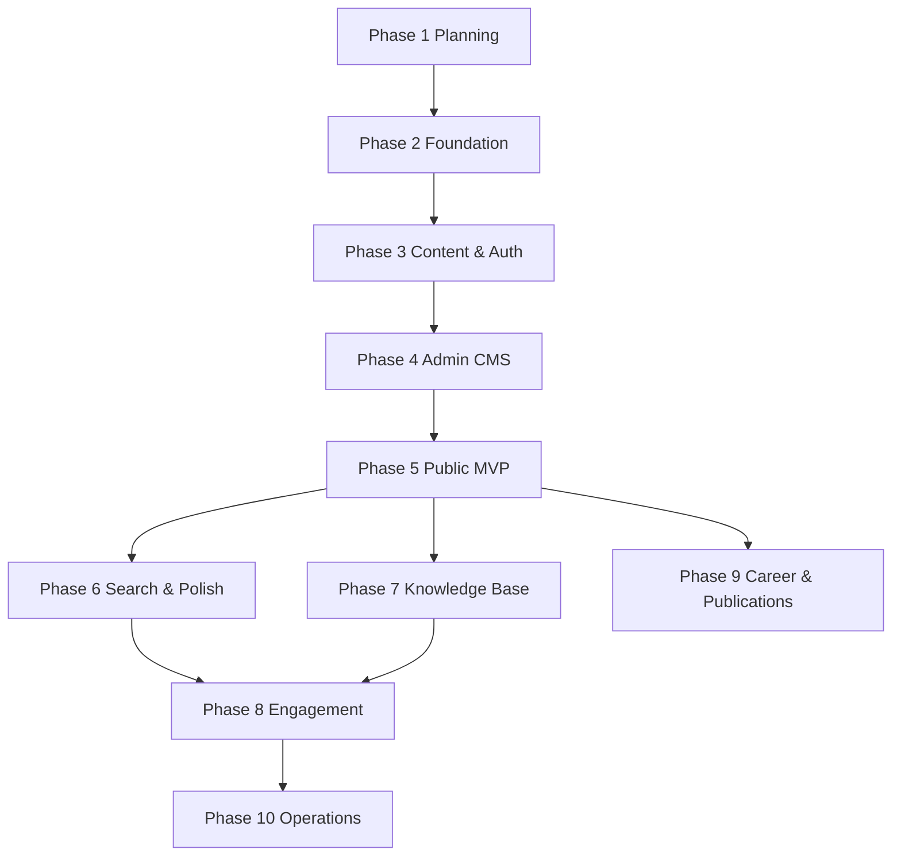

# Implementation Roadmap

Ten-phase roadmap from foundation to advanced features. Complexity: **S** (Small, ≤1 week), **M** (Medium, 1–2 weeks), **L** (Large, 2–4 weeks). Estimates assume solo developer.

---

## Phase Overview

| Phase | Name | Goal | Complexity | Depends On |
|-------|------|------|------------|------------|
| 1 | Architecture & Planning | Complete system design docs | S | — |
| 2 | Foundation & Infrastructure | Runnable app skeleton + Supabase | M | Phase 1 |
| 3 | Content Layer & Auth | Schema, RLS, GitHub OAuth, seed data | L | Phase 2 |
| 4 | Admin CMS Core | CRUD + Tiptap for primary types | L | Phase 3 |
| 5 | Public Site MVP | Public routes, SEO, contact form | L | Phase 4 |
| 6 | Search, Preview & Polish | FTS, preview tokens, revisions | M | Phase 5 |
| 7 | Knowledge Base Expansion | Research, automation, notes, open source | M | Phase 5 |
| 8 | Engagement Features | Newsletter, AI demos | L | Phase 6, 7 |
| 9 | Career & Publications | Speaking, publications, JSON Resume | M | Phase 5 |
| 10 | Operations & Scale | Monitoring, backups, performance, health checks | M | Phase 8 |

---

## Phase 1 — Architecture & Planning

**Goal:** Produce comprehensive planning documentation; align on content model, routes, flows, and tech stack before any code.

**Deliverables:**
- `docs/architecture.md`
- `docs/sitemap.md`
- `docs/content-model.md`
- `docs/user-flows.md`
- `docs/technical-decisions.md`
- `docs/roadmap.md`

**Dependencies:** None

**Complexity:** S

**Risks:**
- Over-planning delays build — mitigated by time-boxing Phase 1
- Requirements drift — mitigated by explicit future phases

**Exit criteria:** Stakeholder review of docs; Ready For Phase 2 = YES

---

## Phase 2 — Foundation & Infrastructure

**Goal:** Bootstrap Next.js 15 project with TypeScript, Tailwind, shadcn/ui, Supabase client, and deployment pipeline.

**Key tasks:**
- Initialize Next.js 15 App Router project
- Configure Tailwind + shadcn/ui theme tokens (Notion/Linear-inspired neutrals)
- Set up Supabase project (dev + prod)
- Add ESLint, Prettier, Vitest scaffold
- Vercel project linking and env vars
- Folder structure per `architecture.md`
- Placeholder layouts: `(public)` and `admin` route groups

**Dependencies:** Phase 1

**Complexity:** M

**Risks:**
- Next.js 15 caching surprises — document revalidation patterns early
- Env var misconfiguration — use `.env.example`

**Exit criteria:** Deployed hello-world on Vercel; Supabase connection verified

---

## Phase 3 — Content Layer & Auth

**Goal:** Implement database schema, migrations, RLS policies, GitHub OAuth, and admin middleware.

**Key tasks:**
- SQL migrations for all content types (see `content-model.md`)
- Junction tables: skills relations, project-blog links
- RLS: public SELECT on `published`; authenticated CRUD for admin
- Supabase Auth GitHub provider
- Next.js middleware: protect `/admin/*`
- Allowlist enforcement
- Seed script with sample project and blog
- Zod validators mirroring content model

**Dependencies:** Phase 2

**Complexity:** L

**Risks:**
- RLS policy gaps — write policy tests before Phase 5 public launch
- Migration churn — finalize content model before this phase ends

**Exit criteria:** Admin can log in; seed data readable via server queries

---

## Phase 4 — Admin CMS Core

**Goal:** Build admin dashboard and CRUD interfaces with Tiptap editor for Projects, Blogs, Experience, Skills, Education, Settings.

**Key tasks:**
- Admin layout: sidebar nav per sitemap
- Dashboard widgets (counts, recent activity)
- List views with DataTable (shadcn)
- Create/edit forms with react-hook-form + Zod
- Tiptap editor: starter kit + code block + image upload
- Autosave drafts (debounced Server Actions)
- Publish/unpublish workflow
- Media upload to Supabase Storage
- Settings page (site metadata, social, featured IDs)

**Dependencies:** Phase 3

**Complexity:** L

**Risks:**
- Editor scope creep — lock extension set in Phase 4
- Autosave conflict — last-write-wins acceptable initially

**Exit criteria:** Full content lifecycle in admin for core types without public site

---

## Phase 5 — Public Site MVP

**Goal:** Ship all public routes with production-quality rendering, SEO, contact form, and resume download.

**Key tasks:**
- Public layouts and navigation
- Routes: `/`, `/projects`, `/projects/[slug]`, `/blogs`, `/blogs/[slug]`, `/experience`, `/contact`
- Tiptap JSON → HTML renderer (shared with preview)
- ISR/on-demand revalidation on publish
- SEO: metadata, sitemap.xml, robots.txt, JSON-LD
- Contact form Server Action + `ContactSubmission` table
- Email notification via Resend
- Resume: structured admin + PDF generation spike and download on `/experience`
- 404 and error pages

**Dependencies:** Phase 4

**Complexity:** L

**Risks:**
- PDF generation on serverless — spike early in phase
- SEO incomplete — checklist before launch

**Exit criteria:** Public site usable end-to-end; Lighthouse SEO ≥ 90

---

## Phase 6 — Search, Preview & Polish

**Goal:** Improve discoverability, admin preview, content revisions, and UX polish.

**Key tasks:**
- Postgres FTS: tsvector columns + search API
- Global or section search UI
- Signed preview tokens for draft content
- Content revision snapshots before publish
- Admin: contact submission inbox
- Optimistic UI improvements, loading states, toast notifications
- Accessibility audit (WCAG 2.1 AA target)
- E2E tests: login, publish, public visibility

**Dependencies:** Phase 5

**Complexity:** M

**Risks:**
- FTS performance — monitor query plans
- Preview token leakage — short TTL + HMAC

**Exit criteria:** Search works across projects and blogs; preview flow matches user-flows.md

---

## Phase 7 — Knowledge Base Expansion

**Goal:** Complete Research and Automation sections; Public Notes; Open Source showcase.

**Key tasks:**
- Public routes: `/research`, `/automation`
- Admin: `/admin/research`, `/admin/automation`
- Research types and filters
- Optional `/notes` or research filter for public notes
- Projects: `open_source` metadata + GitHub repo link enrichment (optional sync job)
- RSS feed for blogs and research
- Cross-linking UI in admin (related projects/blogs)

**Dependencies:** Phase 5 (can parallel partial work after Phase 4)

**Complexity:** M

**Risks:**
- GitHub API rate limits — cache repo metadata
- Route proliferation — prefer filters over new routes where possible

**Exit criteria:** All sitemap public routes live; open source filter on projects

---

## Phase 8 — Engagement Features

**Goal:** Newsletter subscription and AI demo showcase.

**Key tasks:**
- `NewsletterIssue` or blog series model
- `/newsletter` archive + subscribe form
- Resend (or Brevo) integration for broadcast
- Subscriber table + double opt-in
- AI Demos: demo config on projects, `/demos/[id]` optional route
- Server-side proxy for LLM API calls with rate limits
- Embed sandbox for demos (iframe isolation)

**Dependencies:** Phase 6, 7

**Complexity:** L

**Risks:**
- Email deliverability — SPF/DKIM setup
- AI demo cost abuse — strict rate limits and API key isolation
- GDPR/privacy for newsletter — consent logging

**Exit criteria:** Newsletter send tested; at least one demo embeddable safely

---

## Phase 9 — Career & Publications

**Goal:** Speaking engagements, research publications metadata, JSON Resume export.

**Key tasks:**
- `SpeakingEngagement` content type or timeline extension
- `/talks` or `/experience` integration
- Research: DOI, arXiv, BibTeX import/export
- JSON Resume schema export endpoint
- Multiple resume variants in admin
- Enhanced `/experience` timeline with talks

**Dependencies:** Phase 5

**Complexity:** M

**Risks:**
- Citation format edge cases — support common cases only initially
- Resume variant complexity — limit to 2 variants in v1

**Exit criteria:** Publications display correctly; JSON Resume validates

---

## Phase 10 — Operations & Scale

**Goal:** Production hardening, observability, backups, and automation health checks.

**Key tasks:**
- Error tracking (Sentry)
- Uptime monitoring
- Supabase backup verification
- Database index review and query optimization
- Automation `health_check_url` polling (optional dashboard widget)
- Security audit: RLS review, dependency audit
- Documentation: runbook for deploy, rollback, content restore
- Performance: Core Web Vitals monitoring
- Consider Meilisearch if FTS insufficient

**Dependencies:** Phase 8

**Complexity:** M

**Risks:**
- Over-engineering ops for portfolio traffic — prioritize high-impact items
- Cost creep from monitoring + search services

**Exit criteria:** Runbook complete; error tracking live; backup restore tested once

---

## Dependency Graph

---

## Milestone Checkpoints

| Milestone | Phases | User-visible outcome |
|-----------|--------|----------------------|
| **M0: Plan complete** | 1 | Documentation approved |
| **M1: Admin usable** | 2–4 | Owner can manage content |
| **M2: Public launch** | 5 | Portfolio live for recruiters |
| **M3: Full sitemap** | 6–7 | All listed public routes |
| **M4: Growth features** | 8–9 | Newsletter, demos, talks |
| **M5: Production grade** | 10 | Monitored, backed up, documented ops |

---

## Risk Register (Cross-Phase)

| Risk | Impact | Likelihood | Mitigation |
|------|--------|------------|------------|
| RLS data leak | Critical | Low | Policy tests, security review Phase 5 |
| Scope creep in admin | High | Medium | Phase boundaries, MVP first |
| Serverless PDF timeout | Medium | Medium | Phase 4 spike; fallback generator |
| Solo maintainer burnout | High | Medium | Strict phase scope; defer Phase 8–10 if needed |
| Supabase vendor lock-in | Low | Medium | Standard SQL migrations exportable |
| Tiptap XSS | Critical | Low | Strict schema + sanitize on render |

---

## Recommended Phase 2 Starting Point

When Phase 2 begins, execute in this order:

1. `create-next-app` with TypeScript, Tailwind, App Router
2. Supabase project + local CLI
3. shadcn/ui init + base theme
4. Env configuration and Vercel deploy
5. Empty route groups `(public)` and `admin`
6. Supabase SSR auth helpers + middleware stub

See `architecture.md` for monorepo layout and `technical-decisions.md` for stack details.
