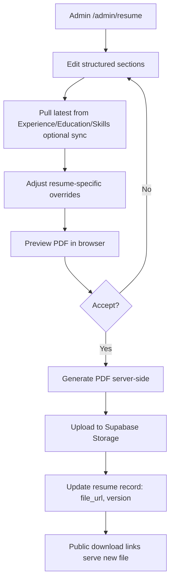
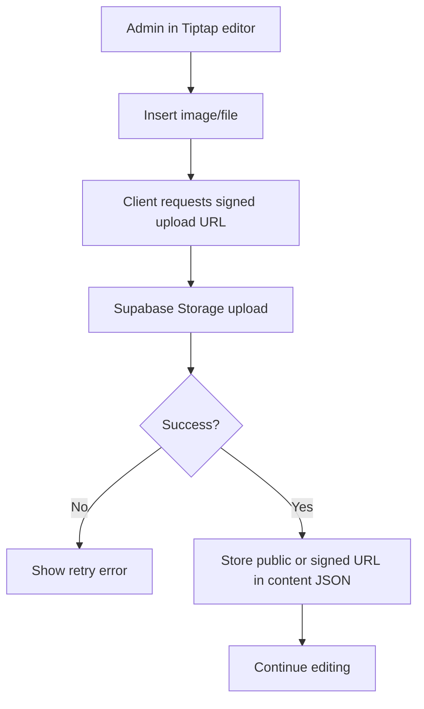
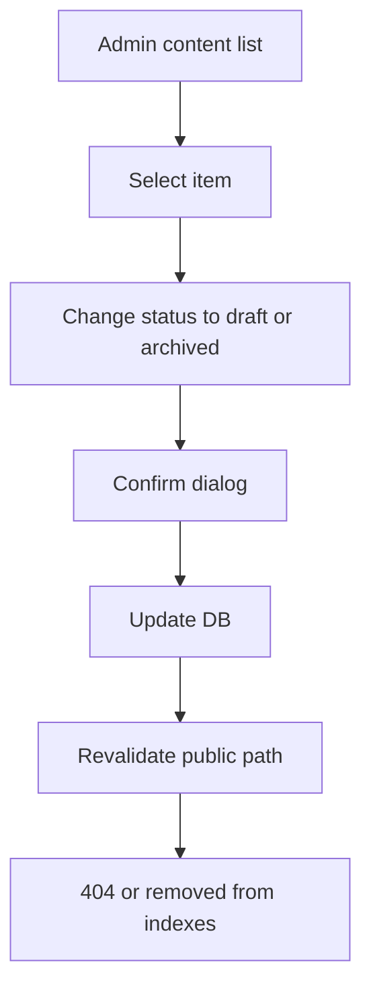

# User Flows

This document describes primary visitor and admin journeys. Diagrams use Mermaid syntax for clarity.

---

## Actors

| Actor | Description |
|-------|-------------|
| **Visitor** | Unauthenticated user browsing the public site |
| **Admin** | Authenticated owner (GitHub OAuth) managing content |
| **System** | Next.js app, Supabase, storage, and external services |

---

## Visitor Flows

### Flow V1: Landing → View Project → Download Resume

**Goal:** Recruiter discovers work and obtains resume.

```mermaid
flowchart TD
    A[Visitor lands on /] --> B[Scan hero and featured projects]
    B --> C{Interested in a project?}
    C -->|Yes| D[Click project card]
    C -->|No| E[Navigate to /projects]
    D --> F[/projects/slug]
    E --> F
    F --> G[Read case study content]
    G --> H{Want resume?}
    H -->|Yes| I[Click Download Resume CTA]
    H -->|No| J[Explore related projects or leave]
    I --> K{Resume source}
    K --> L[Direct PDF from Supabase Storage]
    K --> M[Navigate to /experience]
    M --> N[Download from experience page]
    L --> O[Visitor has PDF]
    N --> O
```

**Touchpoints:**
- CTAs on `/`, `/projects/[slug]`, `/experience`
- Resume file served from Storage with cache headers; metadata from `Resume` content type

**Failure paths:**
- Missing resume file → show inline message + contact link
- Broken slug → 404 with suggested projects

---

### Flow V2: Landing → Read Blog → Contact

**Goal:** Reader engages with content and reaches out.

```mermaid
flowchart TD
    A[Visitor lands on /] --> B[See latest blog posts section]
    B --> C[Click blog post]
    C --> D[/blogs/slug]
    D --> E[Read article with TOC]
    E --> F{Wants to connect?}
    F -->|Yes| G[Click Contact in nav or inline CTA]
    F -->|No| H[Read related posts or exit]
    G --> I[/contact]
    I --> J[Fill form: name, email, message]
    J --> K[Submit via Server Action]
    K --> L{Validation}
    L -->|Fail| M[Show field errors inline]
    M --> J
    L -->|Pass| N[System stores submission + optional email notify]
    N --> O[Success confirmation]
```

**Touchpoints:**
- Blog related posts at bottom of article
- Contact form rate-limited per IP

---

### Flow V3: Search & Discovery (Phase 6+)

**Goal:** Visitor finds content across types.

```mermaid
flowchart TD
    A[Visitor on any page] --> B[Use global search or section filter]
    B --> C[Enter query]
    C --> D[Debounced search request]
    D --> E[Results grouped by type]
    E --> F[Click result]
    F --> G{Type}
    G -->|Project| H[/projects/slug]
    G -->|Blog| I[/blogs/slug]
    G -->|Research| J[/research - scroll to anchor or future detail]
```

Initial phases: tag filters and section-specific search only. Global search added when content volume justifies it.

---

### Flow V4: Organic SEO Entry

**Goal:** Visitor arrives from search engine directly on content.

```mermaid
flowchart TD
    A[Google/Bing result] --> B[/blogs/slug or /projects/slug]
    B --> C[Read content]
    C --> D[Internal links to other sections]
    D --> E{Convert?}
    E -->|Projects| F[/projects]
    E -->|Contact| G[/contact]
    E -->|Resume| H[/experience]
```

**Requirements:** SSR/SSG for public pages, JSON-LD, sitemap.xml, canonical URLs.

---

## Admin Flows

### Flow A1: Login → Dashboard

```mermaid
flowchart TD
    A[Admin visits /admin] --> B{Session valid?}
    B -->|No| C[Redirect to GitHub OAuth]
    C --> D[GitHub authorizes]
    D --> E[Supabase Auth callback]
    E --> F{Email/username allowlisted?}
    F -->|No| G[403 Unauthorized]
    F -->|Yes| H[Create/update session]
    H --> I[/admin Dashboard]
    B -->|Yes| I
```

**Security:** Allowlist in Settings or env; only owner GitHub account(s) permitted initially.

---

### Flow A2: Dashboard → Edit Content → Preview → Publish

**Goal:** Core CMS loop for any content type (example: blog post).

```mermaid
flowchart TD
    A[Admin on /admin] --> B[Select content type e.g. Blogs]
    B --> C[/admin/blogs]
    C --> D{Action}
    D -->|New| E[Open empty editor]
    D -->|Edit| F[Load existing draft or published]
    E --> G[Tiptap editor + metadata form]
    F --> G
    G --> H[Autosave draft every N seconds]
    H --> I[Admin clicks Preview]
    I --> J[Open preview URL with signed token OR admin preview route]
    J --> K[Review rendered page]
    K --> L{Approve?}
    L -->|No| G
    L -->|Yes| M[Click Publish]
    M --> N{Validation pass?}
    N -->|No| O[Show errors: slug, required fields]
    O --> G
    N -->|Yes| P[Set status=published, published_at=now]
    P --> Q[Invalidate ISR/revalidate public path]
    Q --> R[Content live on public route]
```

**Applies to:** Projects, Blogs, Research, Automation, Experience, Education (with type-appropriate editors).

---

### Flow A3: Resume Update → PDF Regeneration



---

### Flow A4: Media Upload in Editor



---

### Flow A5: Unpublish / Archive



---

## Cross-Cutting Concerns

### Error & Edge Cases

| Scenario | Behavior |
|----------|----------|
| Session expired mid-edit | Autosave preserves draft; re-auth redirects back |
| Slug collision | Validation blocks publish; suggest alternative |
| Upload too large | Client + server size limits with clear message |
| Concurrent edit | Last-write-wins initially; optimistic locking Phase 6+ |

### Accessibility in Flows

- All forms keyboard-navigable
- Preview opens in same tab with "Back to editor" or new tab with warning
- OAuth flow completes with focus management on dashboard

---

## Flow-to-Route Matrix

| Flow | Public Routes | Admin Routes |
|------|---------------|--------------|
| V1 Resume | `/`, `/projects/*`, `/experience` | `/admin/resume`, `/admin/experience` |
| V2 Contact | `/`, `/blogs/*`, `/contact` | `/admin/settings` (notification email) |
| A2 Publish | `/projects/*`, `/blogs/*`, etc. | `/admin/*` per type |
| A3 Resume PDF | `/experience` (download) | `/admin/resume` |
